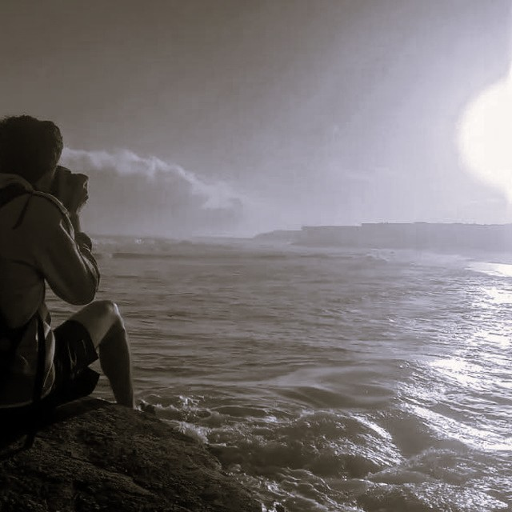

## Mauro Cejas Marcovecchio - Economista viviendo en Buenos Aires

**Buenas!** Soy Mauro Cejas Marcovecchio, economista cipoleño con el privilegio de vivir en la [República Argentina](https://www.tiktok.com/@diario.ole/video/7585157395010080020). Profundamente interesado en comprender la sociedad en la que vivimos a través de los datos.

## Habilidades

Me especializo en ciencia de datos y análisis presupuestario. Intento combinar el detalle en la comprensión de los fenómenos que investigo con la simpleza en la narración y la claridad visual orientadas a la toma de decisiones basadas en evidencia. Programo habitualmente en **Python** y **R**, si bien los avances recientes en inteligencia artificial me han permitido incursionar en **Javascript**. He trabajado en contextos académicos con algoritmos de aprendizaje automático, principalmente en tareas de **Regresión**, **Clasificación**, **Clustering** y **Series temporales**. He tenido acercamientos a la computación en la nube mediante **AWS** y **GCP**, así como en el manejo de grandes volúmenes de datos a través de **Spark** y **Kafka**. Por último, en cuanto a la gestión de bases de datos, he empleado tanto sistemas relacionales (**MySQL**) como no relacionales (**MongoDB**).

## Aprendizaje

La dinámica de la industria tecnológica ha hecho que estar al tanto de las últimas tendencias y avances en la inteligencia artificial sea imprescindible. De todas formas, su uso representa un complemento para el conocimiento, no un sustituto. En ese sentido es que, durante los últimos años, he participado de diplomaturas de análisis de datos (UNAB), gestión financiera (UNSAM), cursos de Inteligencia Artificial (BID, Google) y actualmente estoy escribiendo mi tesis para la Maestría de ciencia de datos (UNAJ).

## Contactame

Si necesitás una mano con algún proyecto, tenés alguna consulta o simplemente querés intercambiar algunas ideas, no dudes en escribirme.

_Un abrazo!_
