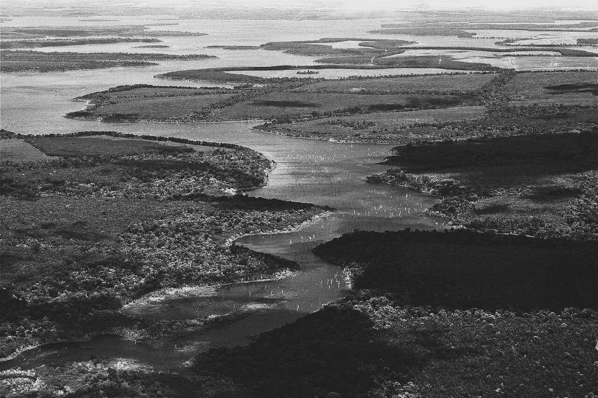

**Resumen del proyecto:**
Análisis exploratorio, procesamiento de datos y desarrollo de modelos de aprendizaje automático para la predicción de la radiación solar global en las localidades de Goya, Bella Vista y Herliszka, de la provincia de Corrientes.

## Objetivo

El objetivo del  trabajo es el análisis exploratorio, preprocesamiento de datos y el desarrollo de modelos de machine learning para la predicción de la radiación global. El dataset utilizado fue obtenido a partir del Sistema de Información y Gestión Agrometeorológica (SIGA), del Instituto Nacional de Tecnología Agropecuaria (INTA). Esta base de datos contiene información de tres estaciones meteorológicas ubicadas en las localidades de Goya, Bella Vista y Herliszka, en la Provincia de Corrientes, Argentina.

## Enlaces y material complementario

- **Repositorio en GitHub:** [https://github.com/cejasmau/tp_aplicaciones/](https://github.com/cejasmau/tp_aplicaciones)  
  Contiene el código fuente, los Jupyter Notebooks y los datos preprocesados.
- **Presentación (PPT):** [Descargar diapositivas](https://github.com/cejasmau/tp_aplicaciones/blob/main/presentacion.pptx)  
  Resumen del flujo de trabajo y los principales hallazgos.
- **Informe en PDF:** [Leer publicación completa](https://github.com/cejasmau/tp_aplicaciones/blob/main/notebook.pdf)  
  Documento final con el análisis exploratorio, la construcción de modelos y la discusión de resultados.

