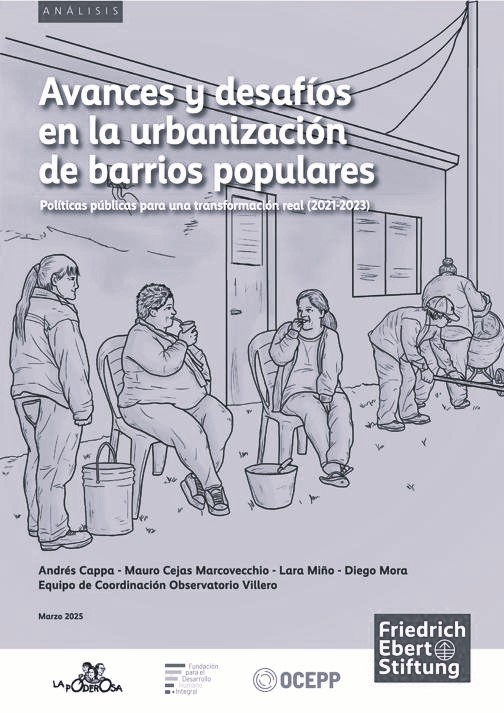

## Resumen del proyecto

La política de integración sociourbana de barrios populares implementada en la Argentina por la Secretaría de Integración Socio Urbana (SISU) del Ministerio de Desarrollo Social de la Nación, marca un cambio de paradigma en las políticas públicas desplegadas en los barrios populares, puesto que se propuso un objetivo muy ambicioso: lograr la integración sociourbana de la totalidad de los barrios populares del país. Con el punto de partida del relevamiento de información básica, a través del Registro Nacional de Barrios Populares (ReNaBaP) realizado en 2016 y la Ley de Barrios Populares (Nº 27.453) se pudo avanzar en políticas que implicaron la planificación y el reordenamiento territorial. 

Estas políticas tuvieron una serie de particularidades; por un lado, no se trató solo de generar las condiciones físicas para un acceso igualitario a la ciudad y a los beneficios urbanos, sino de incorporar una dimensión jurídica, la construcción de infraestructura y equipamiento comunitario, la participación ciudadana en los procesos, el fortalecimiento comunitario y la generación de oportunidades de empleo y capacitación. Pero, por otro lado, el Fondo de Integración Socio Urbana (FISU) que nutrió de recursos a estas políticas, se financió entre 2019 y 2020 a partir de las asignaciones del impuesto a las grandes fortunas (denominado Aporte Solidario y Extraordinario) y del impuesto PAIS. Esto dio un carácter progresivo al financiamiento que proveía de recursos provenientes de sectores de altos ingresos al fondo que financiaba la urbanización de barrios que habitan los sectores populares de la Argentina. Asimismo, el hecho de haber sido derivado de políticas validadas mediante leyes nacionales resulta ser otro factor positivo en términos de legitimidad e impacto distributivo. Parece claro que una política de este tipo supone un horizonte de largo plazo, lo que implica la necesidad de contar con recursos de manera sostenida en el tiempo. 

En este sentido, el cambio de gobierno ocurrido en diciembre de 2023 implicó la interrupción de las obras y la cuasieliminación del financiamiento, lo que puso en jaque la continuidad de la política.

## Enlaces y material complementario

- **Enlace original de la publicación:** [Repositorio de la FES](https://collections.fes.de/publikationen/ident/fes/21968)  

- **Presentación en el Congreso Nacional** [Presentación](https://argentina.fes.de/e/publicacion-avances-y-desafios-en-la-urbanizacion-de-barrios-populares.html)  

- **Publicación en PDF:** [Leer publicación completa](https://collections.fes.de/publikationen/download/pdf/1885828)  